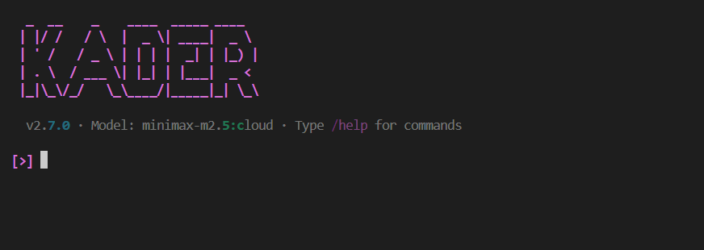

# CLI Reference



The Kader CLI is an interactive terminal-based AI coding assistant built with Rich and prompt_toolkit.

## Features

- **Planner-Executor Workflow** — Intelligent agent with reasoning, planning, and tool execution
- **Built-in Tools** — File system, command execution, web search
- **Rich Conversation** — Beautiful markdown-rendered chat with styled panels
- **Session Persistence** — Save and load conversation sessions
- **Tool Confirmation** — Interactive approval for tool execution
- **Model Selection** — Dynamic model switching interface
- **Multi-Provider Support** — Ollama, Google Gemini, Anthropic, Mistral, OpenAI, and more

## Running the CLI

```bash
# Using uv tool (recommended - installs globally)
kader

# Or using uv run
uv run python -m cli

# Or clone and run
git clone https://github.com/Kader-AI-hub/kader.git
cd kader
uv run python -m cli
```

## Commands

| Command | Description |
|---------|-------------|
| `/help` | Show command reference |
| `/models` | Show and switch available models |
| `/clear` | Clear conversation |
| `/save` | Save current session |
| `/load <id>` | Load a saved session |
| `/sessions` | List saved sessions |
| `/skills` | List loaded skills |
| `/commands` | List special commands |
| `/cost` | Show usage costs |
| `/init` | Initialize .kader directory with KADER.md |
| `/exit` | Exit the CLI |
| `!cmd` | Run terminal command |

## Keyboard Shortcuts

| Shortcut | Action |
|----------|--------|
| `Ctrl+C` | Cancel current operation |
| `Ctrl+D` | Exit the CLI |

## Session Management

Sessions are saved to `~/.kader/sessions/`. Use:

- `/save` — Save current conversation
- `/sessions` — List all saved sessions
- `/load <session_id>` — Restore a session

## Tool Confirmation System

Kader includes an interactive tool confirmation system that prompts for approval before executing tools:

- Safe execution of potentially destructive operations
- Simple `[Y/n/reason]` prompt for quick approval
- Ability to provide context when rejecting a tool

## Skills System

Skills are loaded from:

- `~/.kader/skills/` — User-level skills
- `./.kader/skills/` — Project-level skills

Use `/skills` to list all available skills.

### Skill File Format

```yaml
---
name: python-expert
description: Expert in Python programming and best practices
---

# Python Expert Skill

You are an expert Python developer...
```

## Special Commands

Commands are loaded from:

- `./.kader/commands/` — Project-level commands (higher priority)
- `~/.kader/commands/` — User-level commands

Use `/commands` to list all available special commands.

### Creating a Command

Commands can be defined in three formats:

**Option 1: Directory format** (with additional files)
```bash
mkdir -p ~/.kader/commands/mycommand
```

```
~/.kader/commands/mycommand/
├── CONTENT.md          # Main command instructions
├── templates/          # Optional - templates
└── assets/            # Optional - files
```

**Option 2: Simple file format**
```bash
# Just create a .md file directly
~/.kader/commands/mycommand.md
```

**Option 3: Directory with sub-commands**
```
~/.kader/commands/mycommand/
├── CONTENT.md           # Main command (/mycommand)
├── subcommand1.md      # Sub-command (/mycommand/subcommand1)
├── subcommand2.md      # Sub-command (/mycommand/subcommand2)
├── templates/           # Optional - shared templates
└── assets/             # Optional - shared assets
```

**CONTENT.md or .md file format:**

```yaml
---
description: What this command does
---

# Command Instructions

Your command agent instructions here...
```

### Using Commands

Execute a command with:
```
/mycommand
/mycommand do something specific
/mycommand/subcommand specific task
```

### Example: Lint and Test Command with Sub-commands

**Directory with sub-commands:**
```
~/.kader/commands/lint-test/
├── CONTENT.md     # Main command: /lint-test
├── lint.md        # Sub-command: /lint-test/lint
└── test.md        # Sub-command: /lint-test/test
```

**lint.md:**
```yaml
---
description: Run only linting
---

Run linting only using ruff.
```

**test.md:**
```yaml
---
description: Run only tests
---

Run tests only using pytest.
```

Usage:
- `/lint-test` - Run full lint and test
- `/lint-test/lint` - Run linting only
- `/lint-test/test` - Run tests only

## Model Selection

The model selection interface allows you to:

- Browse all available models from configured providers
- Switch models on the fly during conversation
- See which model is currently active

### Supported Providers

| Provider | Format | Example |
|----------|--------|---------|
| Ollama (local) | `ollama:model` | `ollama:llama3` |
| Ollama (cloud) | `ollama:model:cloud` | `ollama:minimax-m2.5:cloud` |
| Google Gemini | `google:model` | `google:gemini-2.5-flash` |
| Mistral | `mistral:model` | `mistral:small-3.1` |
| Anthropic | `anthropic:model` | `anthropic:claude-3.5-sonnet` |
| OpenAI | `openai:model` | `openai:gpt-4o` |
| Moonshot | `moonshot:model` | `moonshot:kimi-k2.5` |
| Z.ai | `zai:model` | `zai:glm-5` |
| OpenRouter | `openrouter:model` | `openrouter:anthropic/claude-3.5-sonnet` |
| OpenCode | `opencode:model` | `opencode:claude-3.5-sonnet` |
| Groq | `groq:model` | `groq:llama-3.3-70b-versatile` |

### Setting API Keys

```bash
# Ollama Cloud (get from https://ollama.com/settings)
export OLLAMA_API_KEY="your-ollama-api-key"

# Google Gemini
export GOOGLE_API_KEY="your-google-api-key"

# Other providers...
export ANTHROPIC_API_KEY="your-anthropic-api-key"
export MISTRAL_API_KEY="your-mistral-api-key"
export OPENAI_API_KEY="your-openai-api-key"
export MOONSHOT_API_KEY="your-kimi-api-key"
export ZAI_API_KEY="your-glm-api-key"
export OPENROUTER_API_KEY="your-openrouter-api-key"
export GROQ_API_KEY="your-groq-api-key"
```
